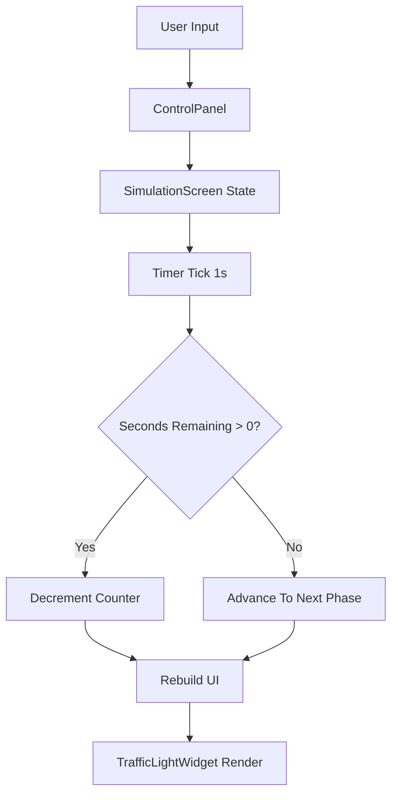

# Architecture

## Overview

The project follows a presentation-first Flutter architecture with explicit simulation state and UI composition. The current scope is a single-intersection signal simulator, designed so additional modules (map integration and reporting) can be layered in without rewriting core app navigation.

Architecture style:
- Component-based UI architecture using Flutter widgets
- Localized state management in feature screens
- Clear separation between screen state orchestration and reusable UI widgets

## Layer Breakdown

### 1. Application Shell Layer

Primary file: `lib/main.dart`

Responsibilities:
- App bootstrap via `runApp`
- Material app configuration (theme, title, debug settings)
- Bottom navigation and tab routing (`Map`, `Simulation`, `Reports`)

### 2. Feature Screen Layer

Primary files:
- `lib/screens/map_screen.dart`
- `lib/screens/simulation_screen.dart`
- `lib/screens/reports_screen.dart`

Responsibilities:
- User interaction handling
- Feature-level state lifecycle
- Composition of reusable widget building blocks

Current status:
- `SimulationScreen` is implemented with runtime simulation logic
- `MapScreen` and `ReportsScreen` are placeholders for future modules

### 3. Reusable Widget Layer

Primary files:
- `lib/widgets/traffic_light_widget.dart`
- `lib/widgets/control_panel.dart`

Responsibilities:
- Render reusable visual components
- Keep display logic isolated from orchestration logic
- Expose callback-based APIs for parent screen control

## Simulation Engine Design

The simulation engine currently lives in `SimulationScreen` as local state.

Core parts:
- `TrafficLightState` enum with 4 phases: `red`, `redAmber`, `green`, `amber`
- Phase transition function for deterministic cycle progression
- `Timer.periodic` heartbeat at 1 second intervals
- Remaining-time counter tied to active phase duration

Phase transition sequence:
1. `red`
2. `redAmber`
3. `green`
4. `amber`
5. loops back to `red`

## Data and Control Flow

## State Ownership

State is intentionally owned by `SimulationScreen`:
- Running/paused status
- Current signal phase
- Remaining seconds
- Configured phase durations

Reason:
- The simulation is currently self-contained.
- Keeping state local reduces complexity and boilerplate.
- Migration to a global pattern (such as Provider/BLoC/Riverpod) remains straightforward if cross-screen synchronization is added.

## Scalability Path

Recommended evolution path:
1. Extract simulation logic into a dedicated service/class (for pure unit testing).
2. Introduce app-level state management if map/report screens start consuming shared simulation state.
3. Add persistence (local storage) for saved timing profiles.
4. Add multi-intersection orchestration with independent signal controllers.

## Reliability Considerations

Implemented safeguards:
- Timer cancelled in `dispose` to avoid leaks
- No-op guard when pressing `Start` while already running
- Countdown reset behavior when active phase duration changes

Future reliability improvements:
- Unit tests for transition matrix and countdown edge cases
- Pause/resume consistency tests
- Optional simulation speed multiplier for testing and demos
